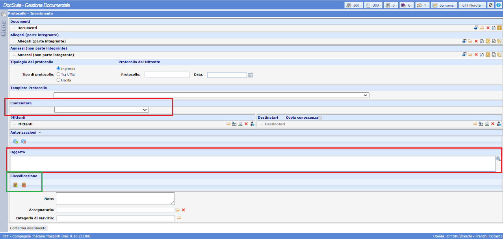
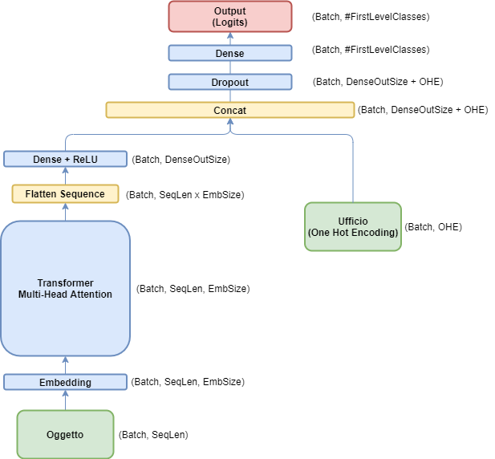

# Automatic document classification tool

Project for the Human Language Technologies course @ University of Pisa

Authors: [Elia Piccoli](https://github.com/EliaPiccoli), [Alex Pasquali](https://github.com/AlexPasqua) and [Nicola Gugole](https://github.com/NicolaGugole)

##

The project was developed in association with *Compagnia Trasporti Toscana (CTT)*, which is the company that handles the public transportation in Tuscany. The focus of the project was to improve the document archiving process in compliance with the Protocollo Informatico Italian law. In fact, the user of public administration, in order to archive a protocol, has to fill various fields, in particular: needs to write a summary of the contents of the document (*Oggetto*), pick the correct document repository for the office (*Contenitore*) and then choose the correct class among many. The model will provide a *top 3/5 prediction* over the possible correct classes.

  

  
   
  <em>User interface. Red boxes represent Model input, green one Model output</em>

  

The analysis will cover models to handle different levels of the *Titolario*:
- **First Level Classification:** the documents can be classified in *15* possible classes.
- **Second Level Classification:** the documents can be classified in *118* possible classes.

 

  
   
  <em>Example of Model architecture</em>

  

The [Report](report/report.pdf) covers the following analysis:
- *Dataset analysis:* analysis over data, rebalancing process and pre-processing
- *First Level model:* first level model that outputs top3 classes using Oggetto and Contenitore information.
- *Second Level model:* second level model that outputs top5 classes using Oggetto and Contenitore information.
- *Test set results:* testing the model over new set of unseen data
- *Comparison with Baselines:* comparing the results with Naive Bayes and BERT models
